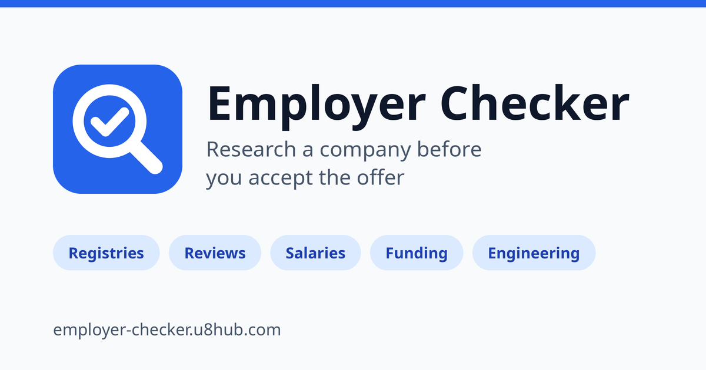

# Employer Checker

Generate useful links to check whether a company is a good place to work.

**Live:** https://employer-checker.u8hub.com/



Enter a company name and get one Google `site:` search per source, grouped by category:

| Group | Sources |
|---|---|
| Jobs & company profiles | DOU, LinkedIn, Djinni, Work.ua, Wellfound |
| Legal & registries | Opendatabot, YouControl, e-Äriregister, GOV.UK Companies House, OpenCorporates, SEC EDGAR, iprop-ua.com |
| Employee reviews & salaries | Glassdoor, Indeed, Blind, Levels.fyi, Kununu, Welcome to the Jungle |
| Clients & B2B reviews | Clutch, Upwork, GoodFirms |
| Startup & funding | Crunchbase, Dealroom, PitchBook, Y Combinator |
| Engineering | GitHub, GitLab, Hacker News |
| Social | Reddit, Facebook, Instagram |

The query is stored in the URL (`?q=`), so a search can be shared as a link.

## Add a source

Edit [`public/sources.js`](public/sources.js) and append `{ name, site }` to the right group.
Please also update the table above and the "Why check an employer?" list in `public/index.html`.

## Run locally

The site is plain static HTML, CSS and JavaScript with no build step.
Tasks are defined in the [`justfile`](justfile) (requires [just](https://github.com/casey/just) and Python 3):

```sh
just dev                # serve on http://localhost:8000 and open the browser
just dev "Grammarly"    # same, with a prefilled query (?q=Grammarly)
just serve              # serve only
PORT=9000 just dev      # use another port
just check              # validate manifest, JSON-LD, sitemap and local file references
just assets             # regenerate icons and og-image.png
```

Without just: `python3 -m http.server 8000 -d public`.

## Icons and Open Graph image

All icons and `og-image.png` are generated from one geometry definition:

```sh
pip install pillow
just assets
```

## Deploy

Netlify serves the `public` directory. Response headers live in `public/_headers`.

## License

[MIT](LICENSE)
